<div class="absolute top-8 left-8">
  
</div>

<div class="absolute top-8 right-8 text-right text-sm opacity-50">
  <div>Denys Vitali</div>
  <div>February 5, 2026</div>
</div>

<div class="h-full flex flex-col justify-center items-center">
  <div class="text-8xl mb-8 animate-pulse">📱</div>
  <h1 class="text-7xl font-bold mb-6 bg-gradient-to-r from-emerald-400 via-cyan-400 to-blue-500 bg-clip-text text-transparent">
    I'm a Happy Engineer
  </h1>
  <div class="w-96 h-1 bg-gradient-to-r from-transparent via-emerald-500 to-transparent mb-8"></div>
  <p class="text-2xl font-light text-emerald-300">
    Code from anywhere. Ship from everywhere.
  </p>
  <div class="mt-12 flex gap-6 text-sm opacity-70">
    <span class="px-4 py-2 bg-white bg-opacity-10 rounded-full border border-white border-opacity-20">
      🤖 AI-Powered
    </span>
    <span class="px-4 py-2 bg-white bg-opacity-10 rounded-full border border-white border-opacity-20">
      🔒 End-to-End Encrypted
    </span>
    <span class="px-4 py-2 bg-white bg-opacity-10 rounded-full border border-white border-opacity-20">
      🚀 Self-Hosted
    </span>
  </div>
</div>

<!--
> [!WARNING]
> **This entire presentation was generated using GLM 4.7** via [Happy](https://happy.engineering), the open-source mobile and web client for Claude Code.
-->

---
layout: center
class: text-center
background: https://images.unsplash.com/photo-1512941937669-90a1b58e7e9c?w=1920&q=80
---

# What is Happy?

<div class="mb-8 p-4 bg-red-500 bg-opacity-20 rounded-lg border-2 border-red-500 border-opacity-40 max-w-2xl mx-auto">
  <div class="text-sm font-bold text-red-300">
    ⚠️ WARNING
  </div>
  <div class="text-sm mt-1 text-white">
    This presentation was generated using <span class="font-semibold text-emerald-300">GLM 4.7</span> via <a href="https://happy.engineering" class="underline">Happy</a>
  </div>
  <div class="text-xs mt-2 opacity-70">
    Based on: <a href="https://blog.denv.it/posts/im-happy-engineer-now/" class="underline">blog.denv.it/posts/im-happy-engineer-now/</a>
  </div>
</div>

<div class="text-2xl mb-8 font-light">
  An <span class="text-emerald-400 font-semibold"><a href="https://happy.engineering" target="_blank">open-source</a></span> mobile and web client for Claude Code
</div>

<br>

<div class="text-lg opacity-70 mb-8 max-w-2xl mx-auto">
  Happy wraps Claude Code (the CLI tool) to provide remote access from your phone, tablet, or browser.<br>
  Think of it as a remote control for your AI coding environment.
</div>

<br>

<div class="text-lg italic mb-6 opacity-90 font-serif">
  "Are you actually trying to write code on your phone?"<br>
  <span class="font-semibold text-white">No. Absolutely not.</span>
</div>

<div class="text-base opacity-70 mb-8">
  It's about <span class="text-emerald-300 font-semibold">micro-sessions</span> throughout the day.
</div>

<br>

<div class="grid grid-cols-5 gap-4 max-w-4xl mx-auto">

<div class="p-4 bg-blue-500 bg-opacity-20 rounded-xl backdrop-blur-sm border border-blue-500 border-opacity-30">
  <div class="text-3xl mb-2">📱</div>
  <div class="text-sm font-medium">Mobile & Web</div>
  <div class="text-xs opacity-60 mt-1">Daylight DC-1</div>
</div>

<div class="p-4 bg-purple-500 bg-opacity-20 rounded-xl backdrop-blur-sm border border-purple-500 border-opacity-30">
  <div class="text-3xl mb-2">🔐</div>
  <div class="text-sm font-medium">E2E Encrypted</div>
</div>

<div class="p-4 bg-emerald-500 bg-opacity-20 rounded-xl backdrop-blur-sm border border-emerald-500 border-opacity-30">
  <div class="text-3xl mb-2">🔄</div>
  <div class="text-sm font-medium">Session Sync</div>
</div>

<div class="p-4 bg-orange-500 bg-opacity-20 rounded-xl backdrop-blur-sm border border-orange-500 border-opacity-30">
  <div class="text-3xl mb-2">🔔</div>
  <div class="text-sm font-medium">Push Notifications</div>
</div>

<div class="p-4 bg-pink-500 bg-opacity-20 rounded-xl backdrop-blur-sm border border-pink-500 border-opacity-30">
  <div class="text-3xl mb-2">🎤</div>
  <div class="text-sm font-medium">Voice</div>
</div>

</div>

---
layout: two-cols
background: https://images.unsplash.com/photo-1550745165-9bc0b252726f?w=1920&q=80
---

# The Happy UI

<div class="text-xl font-light opacity-80 mb-6">
  Native mobile experience
</div>

<br>

## Why It Works

- Proper client-server architecture
- Mobile-first UI design
- Text input is first-class
- Better permissions UX
- Remote session creation

::right::

<div class="h-full flex items-center justify-center">
  
</div>

---
layout: two-cols
---

# Why I'm Happy?

<div class="text-lg italic mb-6 opacity-90 font-serif">
  "I truly enjoy programming, but the most frustrating part for me was that I had many ideas and too little time to work on everything."
</div>

<br>

## The Problem

<v-clicks>

- Too many side project ideas
- Far too few hours
- Tied to the desk
- Dead time during commutes
- Waiting in line = wasted time

</v-clicks>

---

# Solution

<v-clicks>

- **Mobile access** to Claude Code
- **Micro-sessions** throughout the day
- **Reclaim dead time**
- Make progress from anywhere

<br>

<div class="mt-8 p-4 bg-emerald-500 bg-opacity-20 rounded-lg border border-emerald-500 border-opacity-30">
  Transform "I'll handle this later" → "I'll handle this now"
</div>

</v-clicks>

---

# Not About Writing Code on Phone

<div class="text-xl italic opacity-70 mb-8 font-serif">
  "Are you actually trying to write code on your phone?"<br>
  <span class="font-semibold text-white">No. Absolutely not.</span>
</div>

<br>

It's about **micro-sessions**

<div class="grid grid-cols-3 gap-6 mt-8 text-left max-w-3xl mx-auto">

<div>

🚇 **Commuting**

<small class="opacity-60">Make progress on the train</small>

</div>

<div>

🛒 **Waiting**

<small class="opacity-60">In line at the store</small>

</div>

<div>

🛋️ **Away**

<small class="opacity-70">From couch or café</small>

</div>

</div>

---
layout: center
class: text-center
---

# Real Example

<br>

<div class="text-4xl mb-8 font-light">
  <span class="opacity-50">"</span>
  Set up Jellyfin in my cluster using Helm via GitOps
  <span class="opacity-50">"</span>
</div>

<br>

<div class="grid grid-cols-3 gap-6 max-w-4xl mx-auto">

<v-click>

<div class="p-6 bg-blue-500 bg-opacity-20 rounded-xl backdrop-blur-sm border border-blue-500 border-opacity-30">
  <div class="text-5xl mb-4">📱</div>
  <div class="font-semibold text-xl mb-2">Request</div>
  <div class="text-sm opacity-70">From phone while walking</div>
</div>

</v-click>

<v-click>

<div class="p-6 bg-emerald-500 bg-opacity-20 rounded-xl backdrop-blur-sm border border-emerald-500 border-opacity-30">
  <div class="text-5xl mb-4">⚙️</div>
  <div class="font-semibold text-xl mb-2">Execute</div>
  <div class="text-sm opacity-70">Generated Helm, created PR</div>
</div>

</v-click>

<v-click>

<div class="p-6 bg-purple-500 bg-opacity-20 rounded-xl backdrop-blur-sm border border-purple-500 border-opacity-30">
  <div class="text-5xl mb-4">✅</div>
  <div class="font-semibold text-xl mb-2">Deployed</div>
  <div class="text-sm opacity-70">Running before home</div>
</div>

</v-click>

</div>

---
layout: two-cols
---

# Why Self-Host?

> [!NOTE]\
> **Not everyone needs to self-host!** If the public Happy server works well for you, there's no need to run your own infrastructure. Self-hosting is only necessary if you encounter reliability issues (see <a href="https://github.com/slopus/happy/issues/295">#295</a>) or want full control.

<v-clicks>

- Public server timeouts → eventual failure
- Needed for reliable daily work
- Full control over setup
- Better security with private CA

</v-clicks>

---

# Prerequisites

| Component | Purpose | Recommended Implementation |
|-----------|---------|---------------------------|
| **Kubernetes** | Container orchestration | Any K8s distribution (v1.27+) |
| **Tailscale** | Secure network access | Tailscale Operator |
| **PostgreSQL** | Database storage | CloudNativePG operator |
| **Object Storage** | File uploads | Backblaze B2, MinIO, S3 |
| **Secrets** | API keys, credentials | OpenBao, Vault, K8s Secrets |
| **Storage** | Persistent volumes | Longhorn, Ceph, Rook |

<br>

<div class="text-sm opacity-60">
  My cluster runs on Talos Linux
</div>

---
layout: two-cols
---

# SSH vs Happy

## 😓 SSH Problems

<v-clicks>

- TUI flickering
- Key combo issues (Ctrl+A, Ctrl+E)
- No autocorrect
- Copy/paste pain
- Text too small

</v-clicks>

---

## 😊 Happy Benefits

<v-clicks>

- Proper client-server
- Mobile-first UI
- Better permissions UI
- Remote session creation
- Text is first-class

</v-clicks>

<br>

<div class="p-3 bg-emerald-500 bg-opacity-20 rounded-lg text-sm border border-emerald-500 border-opacity-30">
  Designed for mobile from day one
</div>

---
layout: center
background: https://images.unsplash.com/photo-1558494949-ef010cbdcc31?w=1920&q=80
---

# System Architecture

```mermaid {scale: 0.55}
graph TB
    subgraph Devices["User Devices"]
        D1[Smartphone<br/>Happy App]
        D2[Daylight Tablet<br/>Happy App]
        D3[Laptop<br/>Happy Web]
    end

    subgraph K8s["Kubernetes Cluster (Talos)"]
        subgraph Network["Network Layer"]
            TS[Tailscale<br/>hostNetwork: true]
            TR[Traefik Ingress<br/>SSL Termination]
        end
        subgraph Happy["happy Namespace"]
            S[Happy Server<br/>Node.js on :3000]
            DB[(PostgreSQL<br/>CloudNativePG)]
            R[(Redis Cache<br/>v7 Alpine)]
        end
        subgraph Security["openbao Namespace"]
            OB[OpenBao<br/>Secrets Management]
        end
        subgraph Workspace["workspace Namespace"]
            W[Workspace Pods<br/>dev-workspace container<br/>happy-daemon + Claude Code]
        end
    end

    subgraph External["External Services"]
        B2[Backblaze B2<br/>S3-compatible Storage]
        LLM[LLM API Providers<br/>MiniMax · GLM · Anthropic]
    end

    Devices -->|"Tailscale Tunnel"| TS
    TS --> TR
    TR -->|"HTTP(S) Routing"| S
    S -->|"SQL Queries"| DB
    S -->|"Cache Operations"| R
    S -->|"S3 Protocol"| B2
    S <-->|"Session Management"| W
    W -->|"HTTPS API Calls"| LLM
    S -->|"Fetch Secrets"| OB

    classDef client fill:#2ecc71,stroke:#444,stroke-width:2px,color:#fff
    classDef network fill:#9b59b6,stroke:#444,stroke-width:2px,color:#fff
    classDef k8s fill:#3498db,stroke:#444,stroke-width:2px,color:#fff
    classDef external fill:#e67e22,stroke:#444,stroke-width:2px,color:#fff

    class D1,D2,D3 client
    class TS,TR network
    class S,DB,R,W,OB k8s
    class B2,LLM external
```

<br>



---
layout: center
---

# Tech Stack

<div class="grid grid-cols-2 gap-8 max-w-4xl mx-auto text-left">

<div>

### 🎯 Core

- **Happy Server**: Node.js/Express
- **PostgreSQL**: CloudNativePG (10Gi)
- **Redis**: v7 Alpine

<br>

### 🌐 Network

- **Tailscale**: Secure tunnel
- **Traefik**: Ingress + SSL
- **OpenBao**: Secrets

</div>

<div>

### 📦 Storage

- **Backblaze B2**: File uploads
- **Longhorn**: 60Gi volumes

<br>

### 🔧 Platform

- **K8s**: Talos Linux
- **Workspace**: dev-workspace container
- **Arch**: AMD64 + ARM64

</div>

</div>

---
layout: two-cols
---

# Workspace Features

## Containerized Environment

- **Base**: Alpine Linux
- **User**: Non-root (UID 1000)
- **SSH**: Dropbear on :2222
- **Storage**: 60Gi on Longhorn (50Gi for Nix store)
- **Multi-arch**: AMD64 + ARM64

<br>

## Nix Setup

- Single-user Nix
- ~4GB store template
- PVC-based persistence

<br>

## Multi-User Support

Template-based workspaces:
- Per-user isolated storage via PVCs
- Individual SSH keys per workspace
- Separate Nix stores to prevent conflicts
- Easily provision new workspaces

> [!TIP]\
> While I use a single workspace for convenience, the template-based system makes it easy to provision isolated workspaces for different users or projects.

---

# Network Isolation 🔒

## Egress

<div class="text-sm">

✅ Public internet (LLM APIs, packages)<br>
✅ DNS queries (kube-dns)<br>
✅ Happy server (happy.happy.svc.cluster.local)<br>
✅ Tailscale namespace (VPN)<br>
❌ Private networks: 10.0.0.0/8, 172.16.0.0/12, 192.168.0.0/16

</div>

<br>

## Ingress

<div class="text-sm">

✅ SSH from Tailscale only (:2222)<br>
❌ All other inbound

</div>

<br>

<div class="p-3 bg-red-500 bg-opacity-20 rounded-lg text-sm border border-red-500 border-opacity-30">
  Even if compromised, cannot access cluster services
</div>

---
layout: center
class: text-center
background: https://images.unsplash.com/photo-1550751827-4bd374c3f58b?w=1920&q=80
---

# Security Philosophy

<div class="text-4xl font-bold mb-4">
  "YOLO Mode"
</div>

<div class="text-lg opacity-70 mb-8 font-light">
  Bypass permissions for autonomous agents
</div>

<br>

<div class="grid grid-cols-2 gap-8 max-w-4xl mx-auto text-left">

<div>

### ✅ The Magic

- Agents work autonomously
- No constant babysitting
- Progress while away

</div>

<div>

### ⚖️ Calculated Risk

**Worst case:**
- Rotate PAT
- Spin up fresh container

**Protected:**
- Home network
- Production infra
- External credentials

</div>

</div>

---
layout: two-cols
---

# MCP Tools

Extend Claude Code with Model Context Protocol

## GitHub Actions

<div class="text-sm opacity-80">
- Check workflow status<br>
- List workflows<br>
- Manage runs
</div>

<br>

## ArgoCD

<div class="text-sm opacity-80">
- Manage applications<br>
- Deploy, sync, rollback<br>
- Repository management
</div>

---

# MCP Tools (continued)

## Woodpecker CI

<div class="text-sm opacity-80">
- CI build statuses<br>
- Pipeline management<br>
- Debug failures
</div>

<br>

## SearXNG

<div class="text-sm opacity-80">
- Web search<br>
- Self-hosted<br>
- JSON output
</div>

<br>

<div class="mt-4 p-3 bg-blue-500 bg-opacity-20 rounded-lg text-sm border border-blue-500 border-opacity-30">
  <a href="https://github.com/denysvitali">@denysvitali</a>'s MCP servers
</div>

<br>

<div class="p-3 bg-yellow-500 bg-opacity-20 rounded-lg text-sm border border-yellow-500 border-opacity-30">
  <strong>⚠️ Security Tip:</strong> Use GitHub fine-grained PATs limited to specific repositories and read-only permissions when possible. My current single-workspace approach is convenient but not ideal for security isolation.
</div>

---
layout: center
class: text-center
---

# LLM Strategy

<div class="text-base opacity-70 mb-8">
  Different models for different tasks
</div>

<br>

<div class="grid grid-cols-2 gap-6 max-w-4xl mx-auto text-left">

<div class="p-5 bg-blue-500 bg-opacity-20 rounded-xl border border-blue-500 border-opacity-30">
  <div class="flex items-center gap-3 mb-3">
    <span class="text-3xl">💰</span>
    <h3 class="text-xl font-bold">MiniMax M2.1</h3>
  </div>
  <div class="text-sm opacity-90 mb-2">Quick one-offs, simple refactors</div>
  <div class="text-xs opacity-60">$2-10/month • Generous limits</div>
</div>

<div class="p-5 bg-emerald-500 bg-opacity-20 rounded-xl border border-emerald-500 border-opacity-30">
  <div class="flex items-center gap-3 mb-3">
    <span class="text-3xl">🎯</span>
    <h3 class="text-xl font-bold">GLM 4.7</h3>
  </div>
  <div class="text-sm opacity-90 mb-2">Frontend specialist, React/Vue</div>
  <div class="text-xs opacity-60">$3-6/month • Sometimes beats Claude!</div>
</div>

<div class="p-5 bg-purple-500 bg-opacity-20 rounded-xl border border-purple-500 border-opacity-30">
  <div class="flex items-center gap-3 mb-3">
    <span class="text-3xl">🔧</span>
    <h3 class="text-xl font-bold">Gemini 3.0</h3>
  </div>
  <div class="text-sm opacity-90 mb-2">UI debugging, specialized tasks</div>
  <div class="text-xs opacity-60">Free (limited) • Via Antigravity</div>
</div>

<div class="p-5 bg-orange-500 bg-opacity-20 rounded-xl border border-orange-500 border-opacity-30">
  <div class="flex items-center gap-3 mb-3">
    <span class="text-3xl">🧠</span>
    <h3 class="text-xl font-bold">Claude Opus 4.5</h3>
  </div>
  <div class="text-sm opacity-90 mb-2">Complex planning, multi-step refactors</div>
  <div class="text-xs opacity-60">$17-20/month • Moving away from walled garden</div>
</div>

</div>

---
layout: center
---

# Provider Switching

<div class="text-left max-w-3xl mx-auto">

**The limitation:** Can't switch from mobile app

<br>

**The workaround:** Shell scripts

<br>

<div class="text-sm opacity-70 mb-4">~/setup-minimax.sh</div>

```bash
#!/bin/bash
export ANTHROPIC_BASE_URL=https://api.minimax.io/anthropic
export ANTHROPIC_API_KEY=your-minimax-api-key
export ANTHROPIC_DEFAULT_OPUS_MODEL="MiniMax-M2.1"
export ANTHROPIC_DEFAULT_SONNET_MODEL="MiniMax-M2.1"
export ANTHROPIC_DEFAULT_HAIKU_MODEL="MiniMax-M2.1"
```

```bash
# Before starting the daemon, pick your provider:
source ~/setup-minimax.sh
# OR
source ~/setup-zai.sh

happy daemon start
```

<br>

<div class="p-3 bg-blue-500 bg-opacity-20 rounded-lg text-sm border border-blue-500 border-opacity-30">
  <strong>🔮 Future:</strong> <a href="https://github.com/slopus/happy/pull/272">PR #272</a> proposes one-touch profile switching and multi-backend support.
</div>

</div>

---
layout: two-cols
---

# Encryption Model

## 🟢 Client-Side

<div class="text-sm">

- Session metadata
- Agent state
- Message content
- Artifacts
- KV values
- Access keys

</div>

<br>

<div class="p-3 bg-emerald-500 bg-opacity-20 rounded-lg text-sm border border-emerald-500 border-opacity-30">
  Server sees only opaque blobs
</div>

---

# Encryption (cont.)

## 🟠 Server-Side

<div class="text-sm">

- GitHub OAuth tokens
- OpenAI tokens
- Anthropic tokens
- Gemini tokens

</div>

<br>

### Algorithm

- **Data Key**: AES-256-GCM
- **Legacy**: XSalsa20-Poly1305
- **KeyTree** from HANDY_MASTER_SECRET

---
layout: two-cols
---

# Android Patch

## Why My Own CA?

- Private CA via OpenBao
- Proper TLS everywhere
- No CT log leaks
- Defense in depth

<br>

## The Challenge

- Android: system store only
- Private CA in User store
- App didn't recognize it

---

# The Fix

## PR #278

<div class="text-sm">

- Android network security config
- Recognize User Trust Store CAs
- GitHub Actions CI for Android

</div>

<br>

<div class="p-3 bg-emerald-500 bg-opacity-20 rounded-lg text-sm border border-emerald-500 border-opacity-30">
  Traefik handles SSL termination with private CA
</div>

<br>

<div class="p-3 bg-yellow-500 bg-opacity-20 rounded-lg text-sm border border-yellow-500 border-opacity-30">
  <strong>⚠️ Current Annoyance:</strong> Bluetooth interference — the app tells Bluetooth devices it's on a call, interrupting audio playback. See <a href="https://github.com/slopus/happy/issues/236">issue #236</a>.
</div>

---
layout: center
class: text-center
background: https://images.unsplash.com/photo-1579621970563-ebec7560ff3e?w=1920&q=80
---

# Monthly Costs

<br>

<div class="text-base opacity-70 mb-6">
  Multi-provider LLM strategy minimizes costs
</div>

<div class="grid grid-cols-2 gap-12 max-w-4xl mx-auto">

<div>

## LLM APIs

# $22-36/mo

<div class="text-base opacity-70 mt-4">

- MiniMax: $2-10 (Coding Plan)
- GLM: $3-6 (Lite)
- Claude: $17-20 (Pro)

</div>

<div class="text-xs opacity-60 mt-4 p-2 bg-blue-500 bg-opacity-10 rounded">
  Note: Actively moving away from Anthropic to avoid walled garden.
</div>

</div>

<div>

## Infrastructure

# ~$0/mo

<div class="text-base opacity-70 mt-4">

- Backblaze B2: Negligible (few MBs)
- Tailscale: Free tier
- Kubernetes: Self-hosted

</div>

</div>

</div>

---
layout: center
background: https://images.unsplash.com/photo-1460925895917-afdab827c52f?w=1920&q=80
---

# Getting Started

<br>

```bash
npm install -g happy-coder
happy
```

<br>

<div class="grid grid-cols-2 gap-8 max-w-4xl mx-auto text-left">

<div>

### 1️⃣ Try Public Server

- Test the workflow with the default public server
- No infrastructure needed
- Free to start
- Experience mobile workflow before committing

</div>

<div>

### 2️⃣ Explore Ecosystem

- [happy.engineering](https://happy.engineering)
- [GitHub](https://github.com/slopus/happy)
- [Discord](https://discord.gg/fX9WBAhyfD)
- Read the [docs](https://happy.engineering/docs/)

</div>

</div>

<br>

<div class="grid grid-cols-2 gap-8 max-w-4xl mx-auto text-left">

<div>

### 3️⃣ Consider Self-Hosting

> [!NOTE]\
> Only if you need reliability or full control

- Start with k3s or microk8s
- Expand features as needed
- Production-grade with CloudNativePG, Traefik, etc.

</div>

<div>

### 4️⃣ Start Simple, Iterate

- Begin with one LLM provider
- Use existing workspace images initially
- Add multi-provider, custom workspaces later
- Don't over-engineer from day one

</div>

</div>

---

layout: center
class: text-center
---

# Alternatives

If Happy seems too complex for your needs, consider:

<div class="text-3xl mb-4 font-semibold text-blue-400">
  HAPI
</div>

<div class="text-lg opacity-80 max-w-2xl mx-auto">
  A lighter-weight alternative to Happy for remote development.
</div>

<br>

<div class="text-sm opacity-70">
  Check out: <a href="https://github.com/tiann/hapi/blob/main/docs/guide/why-hapi.md">github.com/tiann/hapi</a>
</div>

---

layout: two-cols
---

# Resources

## Official Links

- [Happy Site](https://happy.engineering)
- [Docs](https://happy.engineering/docs/)
- [GitHub](https://github.com/slopus/happy)
- [CLI](https://github.com/slopus/happy-cli)
- [Server](https://github.com/slopus/happy-server)

---

# Related Projects

- [dev-workspace](https://github.com/denysvitali/dev-workspace)
- [gh-actions-mcp](https://github.com/denysvitali/gh-actions-mcp)
- [argocd-mcp](https://github.com/denysvitali/argocd-mcp)
- [woodpecker-ci-mcp](https://github.com/denysvitali/woodpecker-ci-mcp)
- [MCP Protocol](https://modelcontextprotocol.io/)

---
layout: center
class: text-center
---

# Key Takeaways

<br>

<div class="grid grid-cols-2 gap-8 max-w-4xl mx-auto text-left">

<div>

## What Happy Provides

- Remote AI coding
- Mobile-first experience
- End-to-end encryption
- Cross-device sync
- Self-hostable

</div>

<div>

## The Real Value

- Reclaim dead time
- Micro-sessions daily
- Less tethered to desk
- Ship faster
- "Now" not "Later"

</div>

</div>

---
layout: center
class: text-center
background: https://images.unsplash.com/photo-1517694712202-14dd9538aa97?w=1920&q=80
---

# Closing Thoughts

<br>

<div class="text-lg font-light opacity-80 max-w-3xl mx-auto">
  "Self-hosting Happy has given me a reliable, flexible way to use Claude Code across all my devices. The ability to work from anywhere has transformed how I think about development."
</div>

<br>
<br>

<div class="text-xl opacity-70 italic">
  I'm no longer tied to a traditional workstation.<br>
  I can reclaim those small pockets of time throughout the day<br>
  that would otherwise be lost.
</div>

<br>
<br>

<div class="text-2xl font-semibold text-emerald-400">
  Was it worth the effort? Absolutely.
</div>

---
layout: center
class: text-center
background: https://images.unsplash.com/photo-1517694712202-14dd9538aa97?w=1920&q=80
---

# Thank You! 🎉

<br>


<div class="text-3xl mb-8 font-light">
  📱 + 🤖 = 🚀
</div>

<div class="text-lg opacity-70 mb-8">
  Mobile AI-assisted coding from anywhere
</div>

<br>

<div class="flex gap-4 justify-center">

<span class="px-5 py-2.5 bg-blue-500 bg-opacity-30 rounded-lg border border-blue-500 border-opacity-40 font-medium">Open Source</span>

<span class="px-5 py-2.5 bg-emerald-500 bg-opacity-30 rounded-lg border border-emerald-500 border-opacity-40 font-medium">E2E Encrypted</span>

<span class="px-5 py-2.5 bg-purple-500 bg-opacity-30 rounded-lg border border-purple-500 border-opacity-40 font-medium">Self-Hostable</span>

</div>

<br>

<div class="text-sm opacity-60 mt-8 font-light">
  Based on "I'm a Happy Engineer Now" by <a href="https://github.com/denysvitali">@denysvitali</a><br>
  Join the <a href="https://discord.gg/fX9WBAhyfD">Happy Discord</a>
</div>
